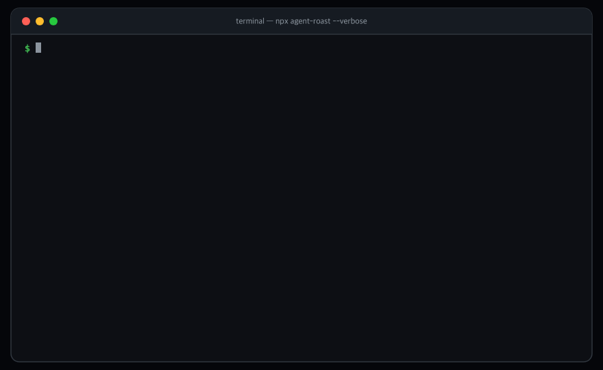
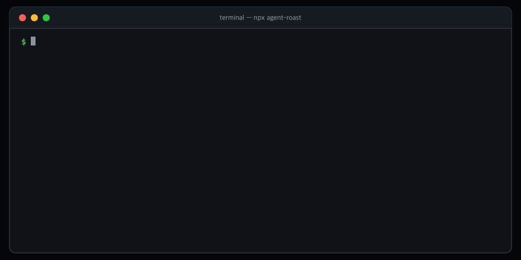

<div align="center">

<picture>
  <source media="(prefers-color-scheme: dark)" srcset="docs/assets/logo-dark.svg">
  
</picture>

<h2>Audit your git history for AI coding agent infractions and panic loops</h2>

<p>
  <a href="https://github.com/Nari-Ab/agent-roast/actions"></a>
  <a href="https://github.com/Nari-Ab/agent-roast"></a>
  <a href="https://www.npmjs.com/package/agent-roast"></a>
  <a href="https://www.npmjs.com/package/agent-roast"></a>
  <a href="LICENSE"></a>
</p>

</div>

`agent-roast` scans recorded git diffs for shortcuts taken by AI coding assistants (Claude Code, Cursor, Aider). It checks for skipped tests, compiler type escapes (`as any`), swallowed errors, and panic revert loops, then outputs a discipline score and line proofs. 100% offline, zero API keys, zero telemetry.

```bash
npx agent-roast            # scan AI-attributed commits (last 90 days)
npx agent-roast --all      # scan entire repository history
npx agent-roast --verbose  # show commit SHAs and line proofs
```

What a report looks like (a real repository audit, trimmed):

```text
agent-roast — git discipline audit (304 AI commits in Soup)

SCORE: 55 / 100 · The Panic Looper
  Prone to rapid-fire fix and revert thrashing cycles when wrestling stubborn bugs.

INFRACTIONS DETECTED (42)

  ● panic-loop (15) — consecutive quick fixes < 15m apart
      latest: 3df29a1 -> a910f21 (3m apart)

  ● type-escape (19) — compiler type bypasses in added lines
      e.g. src/client.ts:42 — response.body as any

  ● test-skip (6) — disabled or skipped test suites
      e.g. tests/test_outbound.py:18 — pytest.skip(...)

  ● swallowed-error (2) — empty catch blocks or except: pass
```





---

### What it checks

Only **added lines** (`+`) in source files are scanned — file moves and refactoring never trigger false alarms.

- **Skipped tests:** `it.skip`, `describe.skip`, `xit`, `pytest.skip`, `test.todo` added when tests fail.
- **Type escapes:** `as any`, `// @ts-ignore`, `// @ts-expect-error`, `# type: ignore`, `eslint-disable`.
- **Swallowed errors:** Empty `catch {}` or `except: pass` blocks hiding production errors.
- **Panic fix loops:** Rapid-fire fix and revert commits by the same author within 15 minutes.

---

### Privacy

- **100% Local:** Runs streaming `git log` on your machine in <200ms.
- **Zero Telemetry:** No cloud dependencies, no LLM API calls, no network traffic.
- **Hermetic:** Source code never leaves your computer.

---

### License

[MIT](LICENSE)
