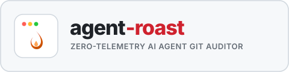
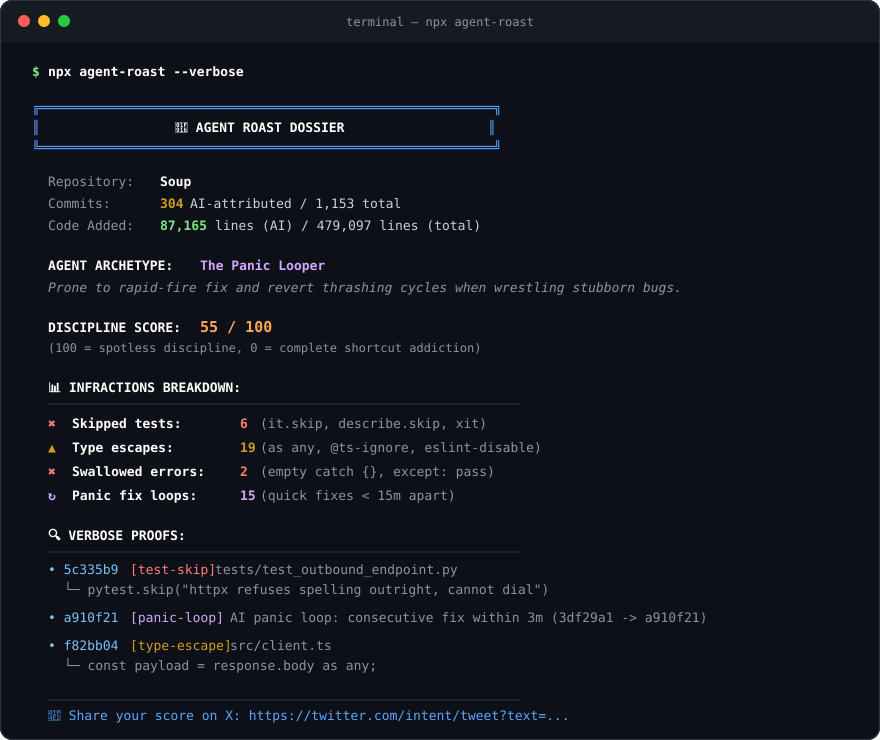

<div align="center">

<picture>
  <source media="(prefers-color-scheme: dark)" srcset="docs/assets/logo-dark.svg">
  
</picture>

### Audit your git history for AI coding agent shortcuts, infractions, and panic loops

[](https://www.npmjs.com/package/agent-roast)
[-1f9d55)](#privacy--zero-telemetry)
[](#performance)
[](LICENSE)

<br/>

```bash
npx agent-roast
```

</div>

---

Did your AI coding assistant write clean, maintainable software — or did it quietly delete failing tests, slap `as any` everywhere, and spam 6 panic commits in 8 minutes?

**`agent-roast`** is an offline, zero-telemetry CLI scorecard that parses git diffs to detect AI shortcuts and calculate an objective **Discipline Score (0–100)** with a personality archetype.

<div align="center">
  
</div>

---

## ⚡️ Quickstart

Run directly in any repository (no install required):

```bash
# Audit AI-attributed commits (Claude Code, Cursor, Aider, Devin, etc.)
npx agent-roast

# Audit ALL commits across repo history (including unverified human commits)
npx agent-roast --all

# Print exact commit SHAs and line snippets for all infractions
npx agent-roast --verbose

# Audit a specific time window (default: last 90 days)
npx agent-roast --since "30 days ago"

# Output structured JSON for CI/CD pipelines
npx agent-roast --json
```

---

## 🔍 What It Detects

`agent-roast` analyzes **only added lines** (`+`) in source code files, eliminating false alarms from refactoring or file renames:

| Infraction | Patterns Detected | Penalty Weight | Why It Matters |
| :--- | :--- | :---: | :--- |
| **Skipped Tests** | `it.skip`, `describe.skip`, `xit`, `pytest.skip`, `test.todo` | **15 pts** | Disabling failing tests instead of fixing the root bug. |
| **Swallowed Errors** | Empty `catch {}`, `except: pass` | **10 pts** | Silencing exceptions and sweeping runtime failures under the rug. |
| **Panic Fix Loops** | Consecutive quickfix commits within 15m by same author | **8 pts** | Frantic thrashing without reading stack traces or logs. |
| **Type Escapes** | `as any`, `// @ts-ignore`, `// @ts-expect-error`, `# type: ignore` | **3 pts** | Bypassing compiler guarantees to pretend code type-checks. |

> [!NOTE]
> String literals and regex patterns are automatically sanitized before analysis. Test fixtures containing pattern names as string data will never trigger false positives.

---

## 🎭 Agent Archetypes

Depending on the dominant infraction patterns, `agent-roast` assigns your agent an archetype:

| Archetype | Icon | Trigger Condition | Personality Dossier |
| :--- | :---: | :--- | :--- |
| **The Clean Coder** | 🧼 | Score $\ge 90$, 0 infractions | Spotless discipline. No skipped tests, zero panic loops, clean type safety. |
| **The Pragmatic Builder** | 🛠️ | Score $\ge 90$, minor compromises | Overwhelmingly disciplined. Only rare, isolated shortcuts across thousands of lines. |
| **The Panic Looper** | ↻ | Dominant panic loops ($\ge 2$) | Prone to rapid-fire fix and revert thrashing cycles when wrestling stubborn bugs. |
| **The Silent Vandal** | ✖ | Dominant skipped tests ($\ge 3$) | When test suites push back, tends to disable or skip tests to keep pipelines green. |
| **The Any Architect** | ▲ | Dominant type escapes ($\ge 5$) | Leans on compiler bypasses (`as any`, `@ts-ignore`) rather than strict type modeling. |
| **The Secret Keeper** | 🤐 | Dominant empty catches ($\ge 2$) | Tends to silence errors with empty catch blocks, obscuring runtime failures. |
| **The Chaos Gremlin** | 🔥 | Score $< 50$, mixed infractions | Mixes multiple shortcuts: skipped tests, type bypasses, and quick patches under pressure. |

---

## 📐 How Scoring Works

1. **Volume Dampening:** To prevent large repos from automatically scoring 99/100, penalties scale sub-linearly using a logarithmic volume curve:
   $$\text{Volume Factor} = 1 + 1.2 \cdot \ln\left(\max\left(1, \frac{\text{LOC Added}}{1000}\right)\right)$$
2. **Commit Caps:** Maximum 10 infractions counted per commit to prevent a single refactoring commit from dominating the entire audit.
3. **Small Sample Protection:** Repositories with fewer than 200 lines of added code display `INSUFFICIENT DATA` instead of a premature score.

---

## 🤖 AI Attribution

`agent-roast` recognizes commits authored or co-authored by AI tools through:
- Git trailers (`Co-Authored-By: Claude <noreply@anthropic.com>`, Cursor, Aider, etc.)
- Commit messages (`generated by aider`, `authored by cursor`)
- Author emails and usernames containing recognized bot signatures

To audit all commits regardless of attribution, pass the `--all` flag.

---

## 🔒 Privacy & Zero Telemetry

- **100% Local Execution:** Runs streaming `git log` directly on your machine in under 200ms.
- **Zero Network Calls:** No external API requests, no telemetry, no analytics.
- **Hermetic:** Source code never leaves your computer.

---

## 🚦 GitHub Actions CI Integration

Fail a PR if an agent's discipline score drops below 60:

```yaml
name: Agent Audit
on: [pull_request]

jobs:
  roast:
    runs-on: ubuntu-latest
    steps:
      - uses: actions/checkout@v4
        with:
          fetch-depth: 0
      - name: Run agent-roast
        run: |
          npx agent-roast --since "7 days ago" --json > roast.json
          SCORE=$(jq '.score' roast.json)
          echo "Discipline Score: $SCORE / 100"
          if [ "$SCORE" -lt 60 ]; then
            echo "❌ Agent discipline score below 60!"
            exit 1
          fi
```

---

## 📄 License

[MIT](LICENSE)
